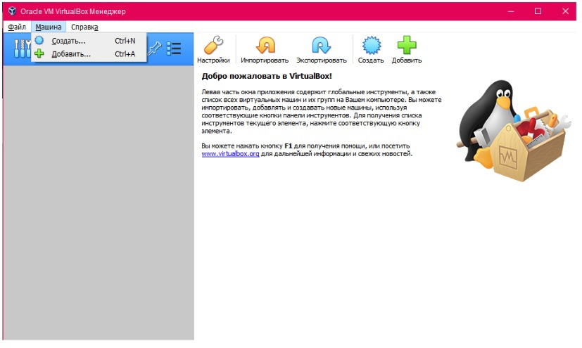
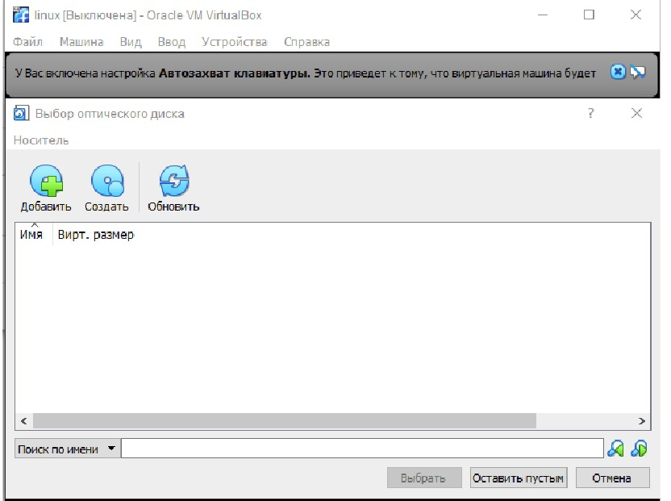
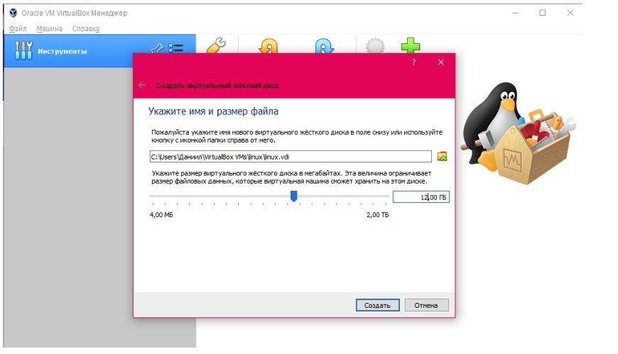
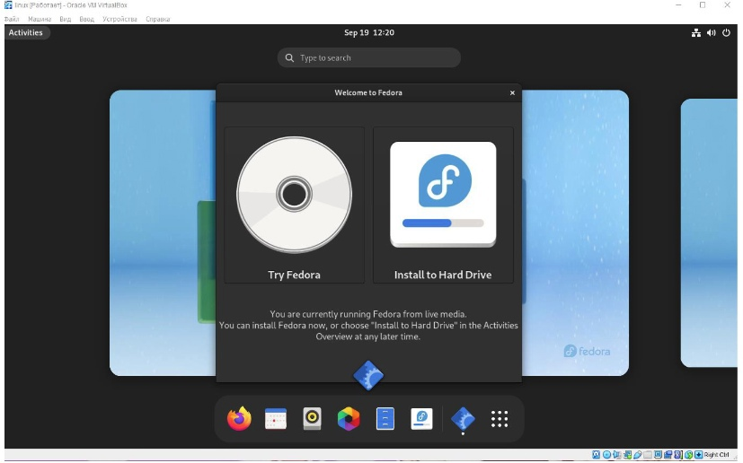
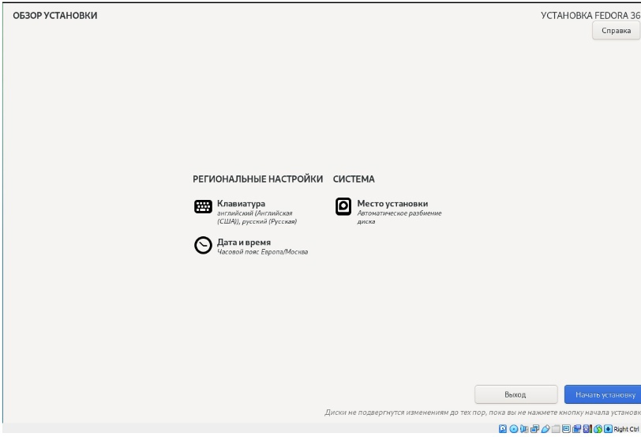
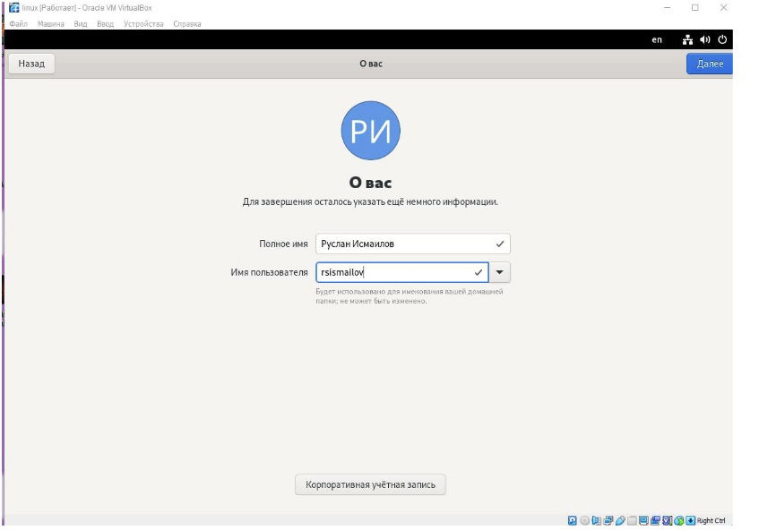
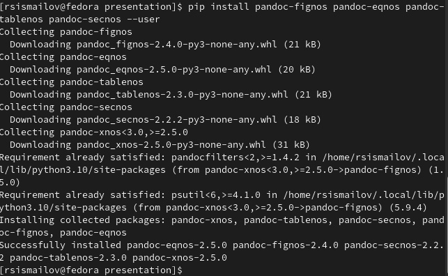

---
## Front matter
lang: ru-RU
title: Структура научной презентации
subtitle: Простейший шаблон
author:
  - Руслан Исмаилов Шухратович
institute:
  - Российский университет дружбы народов, Москва, Россия
date: 18 Февраля 2023

## i18n babel
babel-lang: russian
babel-otherlangs: english

## Formatting pdf
toc: false
toc-title: Содержание
slide_level: 2
aspectratio: 169
section-titles: true
theme: metropolis
header-includes:
 - \metroset{progressbar=frametitle,sectionpage=progressbar,numbering=fraction}
 - '\makeatletter'
 - '\beamer@ignorenonframefalse'
 - '\makeatother'
---

# Вводная часть

## Цель работы

Целью данной работы является приобретение практических навыков установки операционной системы на виртуальную машину, настройки минимально необходимых для дальнейшей работы сервисов.

## Задачи

Установить виртуальную машину и успешно запустить linux, установить необходимые компоненты 

# Выполнение работы

## Шаг 1 

Нужно установить Oracle Vm Virtualbox для создания виртуальной машины, и требуется скачать образ диска Linux. Создаем новую виртуальную машину

{#fig:001 width=70%}

## Шаг 2 
Устанавливаем выделенное количество памяти на виртуальную машину, выбираем файл образа диска для начала установки

{#fig:003 width=70%}

## Шаг 2 
{#fig:002 width=70%} 

## Шаг 3 

После некоторого времени открывается установщик fedora, выбираем опцию 'install to hard drive'

{#fig:004 width=70%}

## Шаг 4 

выбираем нужные настройки, ждём установки

{#fig:005 width=70%}

## Шаг 5

После установки ставим желаемое имя пользователя и завершаем установку

{#fig:006 width=70%}

## Шаг 6

Установка Tex, texlive и pandoс (уже установлено в предыдущем семестре)

{#fig:007 width=70%}

## Конец

Спасибо за внимание!
