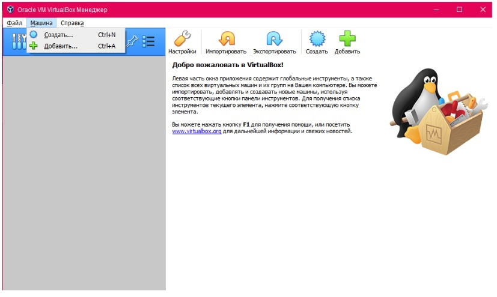
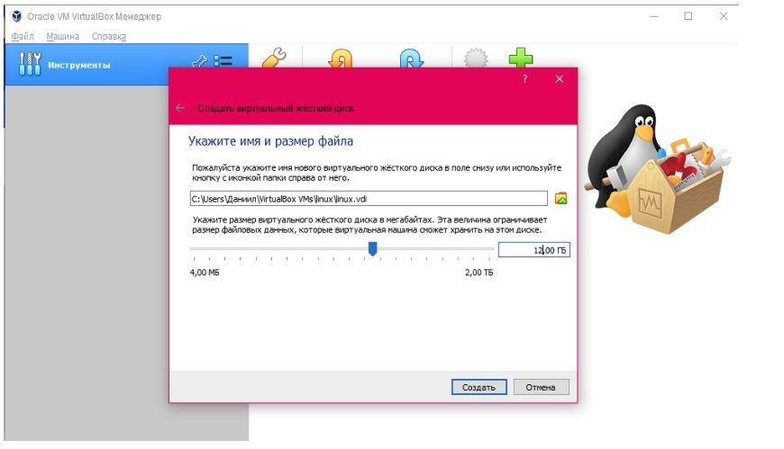
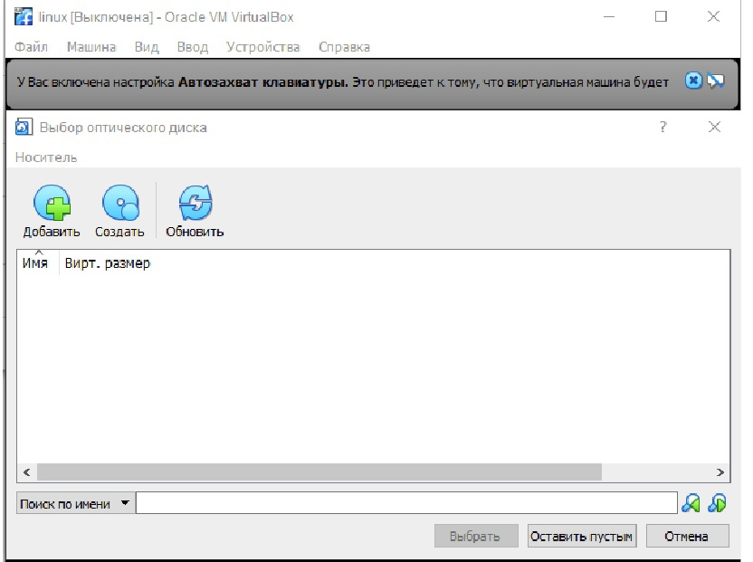
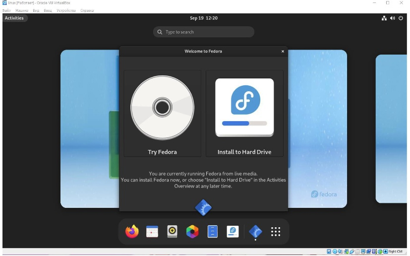
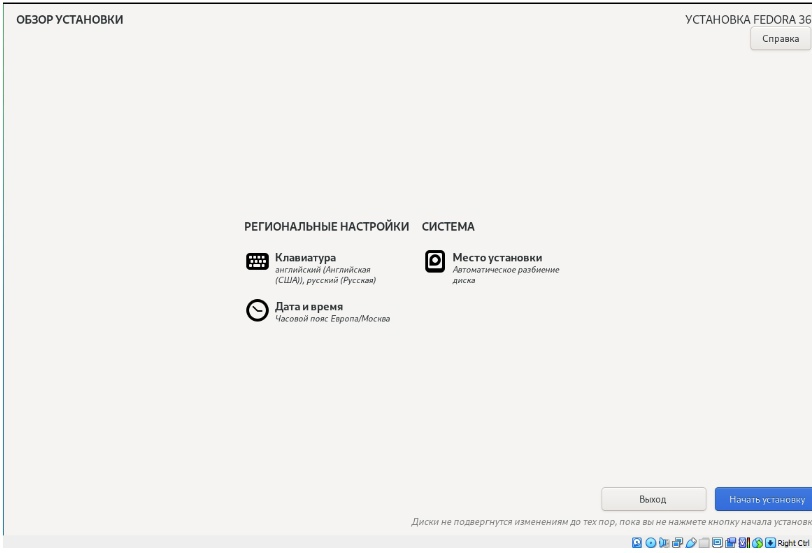
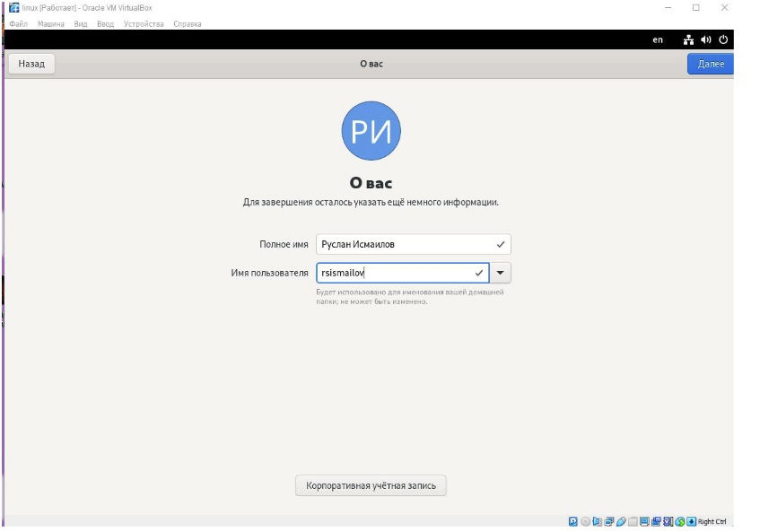
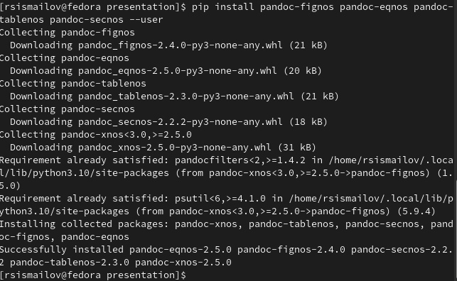

---
## Front matter
title: "Лабораторная работа 1"
author: "Руслан Исмаилов Шухратович"

## Generic otions
lang: ru-RU
toc-title: "Содержание"

## Bibliography
bibliography: bib/cite.bib
csl: pandoc/csl/gost-r-7-0-5-2008-numeric.csl

## Pdf output format
toc: true # Table of contents
toc-depth: 2
lof: true # List of figures
lot: true # List of tables
fontsize: 12pt
linestretch: 1.5
papersize: a4
documentclass: scrreprt
## I18n polyglossia
polyglossia-lang:
  name: russian
  options:
	- spelling=modern
	- babelshorthands=true
polyglossia-otherlangs:
  name: english
## I18n babel
babel-lang: russian
babel-otherlangs: english
## Fonts
mainfont: PT Serif
romanfont: PT Serif
sansfont: PT Sans
monofont: PT Mono
mainfontoptions: Ligatures=TeX
romanfontoptions: Ligatures=TeX
sansfontoptions: Ligatures=TeX,Scale=MatchLowercase
monofontoptions: Scale=MatchLowercase,Scale=0.9
## Biblatex
biblatex: true
biblio-style: "gost-numeric"
biblatexoptions:
  - parentracker=true
  - backend=biber
  - hyperref=auto
  - language=auto
  - autolang=other*
  - citestyle=gost-numeric
## Pandoc-crossref LaTeX customization
figureTitle: "Рис."
tableTitle: "Таблица"
listingTitle: "Листинг"
lofTitle: "Список иллюстраций"
lotTitle: "Список таблиц"
lolTitle: "Листинги"
## Misc options
indent: true
header-includes:
  - \usepackage{indentfirst}
  - \usepackage{float} # keep figures where there are in the text
  - \floatplacement{figure}{H} # keep figures where there are in the text
---

# Цель работы

Целью данной работы является приобретение практических навыков установки операционной системы на виртуальную машину, настройки минимально необходимых для дальнейшей работы сервисов.

# Задание

Установить виртуальную машину и успешно запустить linux, установить необходимые компоненты 

# Выполнение лабораторной работы

Нужно установить Oracle Vm Virtualbox для создания виртуальной машины, и требуется скачать образ диска Linux. Создаем новую виртуальную машину

(рис. @fig:001).

{#fig:001 width=70%}

Устанавливаем выделенное количество памяти на виртуальную машину, выбираем файл образа диска для начала установки

(рис. @fig:002).

{#fig:002 width=70%} 

(рис. @fig:003).

{#fig:003 width=70%}

После некоторого времени открывается установщик fedora, выбираем опцию 'install to hard drive'

(рис. @fig:004).

{#fig:004 width=70%}

выбираем нужные настройки, ждём установки

(рис. @fig:005).

{#fig:005 width=70%}

После установки ставим желаемое имя пользователя и завершаем установку

(рис. @fig:006).

{#fig:006 width=70%}

Установка Tex, texlive и pandoс (уже установлено в предыдущем семестре)

(рис. @fig:007).

{#fig:007 width=70%}

# Контрольные вопросы 

1

Учётная запись пользователя содержит:
Имя пользователя (user name)
 Идентификационный номер пользователя (UID)
 Идентификационный номер группы (GID).
 Пароль (password)
 Полное имя (full name)
 Домашний каталог (home directory)
 Начальную оболочку (login shell)
 
 2
 
 Команды терминала:
 Для получения справки по команде:
 
man [команда]. 
Например, команда «man ls» выведет справку о
команде «ls».
 Для перемещения по файловой системе:
cd [путь]. Например, команда «cd newdir» 
осуществляет переход в
каталог newdir
 Для просмотра содержимого каталога:
ls [опции] [путь]. Например, 
команда «ls –a ~/newdir» отобразит
имена скрытых файлов в каталоге newdir
 Для определения объёма каталога:
du [опция] [путь]. Например, команда 
«du –k ~/newdir» выведет
размер каталога newdir в килобайтах
 Для создания / удаления каталогов / файлов:
mkdir [опции] [путь] / rmdir [опции] [путь]
/ rm [опции] [путь].
Например, команда «mkdir –p ~/newdir1/newdir2» создаст
иерархическую цепочку подкаталогов, создав каталоги newdir1 и
newdir2; команда «rmdir -v ~/newdir» удалит каталог newdir;
команда «rm –r ~/newdir» так же удалит каталог newdir
 Для задания определённых прав на файл / каталог:
сhmod [опции] [путь]. Например, команда «сhmod g+r ~/text.txt»
даст группе право на чтение файла text.txt
 Для просмотра истории команд:
history [опции]. Например, команда «history 5» покажет список
последних 5 кома
 
 3
 
 Файловая система (англ. «file system») – это архитектура хранения
данных в системе, хранение данных в оперативной памяти и доступа к
конфигурации ядра. Файловая система устанавливает физическую и
логическую структуру файлов, правила их создания и управления ими.
В физическом смысле файловая система Linux представляет собой
пространство раздела диска, разбитое на блоки фиксированного
размера. Их размер кратен размеру сектора: 1024, 2048, 4096 или 8120
байт.

4

Команда «findmnt» или «findmnt --all» будет отображать все
подмонтированные файловые системы или искать файловую систему

5
для передачи сигналов процессам в Linux используется утилита
kill, её синтаксис: kill [-сигнал] [pid_процесса] (PID – уникальный
идентификатор процесса). Сигнал представляет собой один из выше
перечисленных сигналов для завершения процесса.

# Домашнее задание 

C помощью поиска с командой dmesg | grep -i "то, что ищем" находим информацию 

    Версия ядра Linux (Linux version). -
    Linux version 5.17.5-300.fc36.x86_64 
    (mockbuild@bkernel01.iad2.fedoraproject.org) 
    (gcc (GCC) 12.0.1 20220413 (Red Hat 12.0.1-0), 
    GNU ld version 2.37-24.fc36) #1 SMP PREEMPT Thu Apr 
    28 15:51:30 UTC 2022

Linux version 5.17.5-300.fc36.x86_64

    Частота процессора (Detected Mhz processor). 
    - vmware: TSC freq read from hypervisor : 3194.011 MHz
    
3194.011 MHz

    Модель процессора (CPU0). - 
    CPU0: AMD Ryzen 7 PRO 2700 Eight-Core Processor 
    (family: 0x17, model: 0x8, stepping: 0x2)
    
AMD Ryzen 7 PRO 2700

    Объём доступной оперативной памяти 
    (Memory available). mwgfx 0000:00:0f.0: 
    [drm] Maximum display memory size is 262144 kiB
    
    262144 КБ
    
    Тип обнаруженного гипервизора (Hypervisor detected). Hypervisor detected: VMware
    
гипервизор - VMware

    Тип файловой системы корневого раздела.
    EXT4-fs (sda1): mounted filesystem with ordered data mode. 
    Quota mode: none.
EXT4-fs
    Последовательность монтирования файловых систем.
    EXT4-fs (sda1): mounted filesystem with ordered data mode. 
    Quota mode: none.
EXT4-fs

# Выводы

Я смог установить Linux и необходимые компоненты к нему, и использовать терминал для выполнения базовых вещей 
