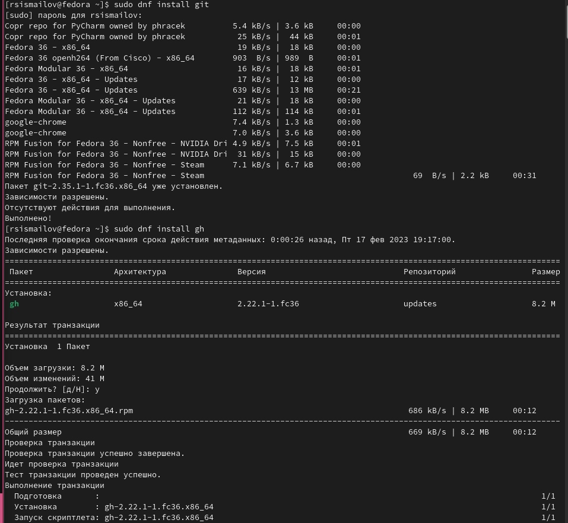
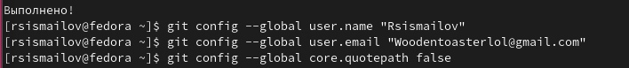
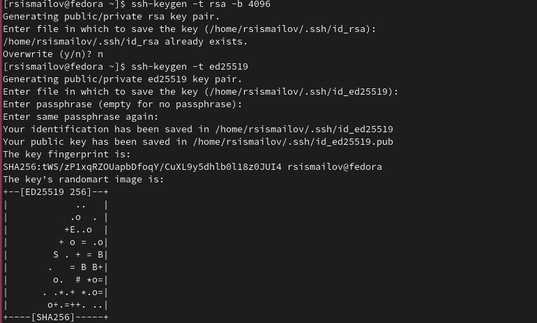
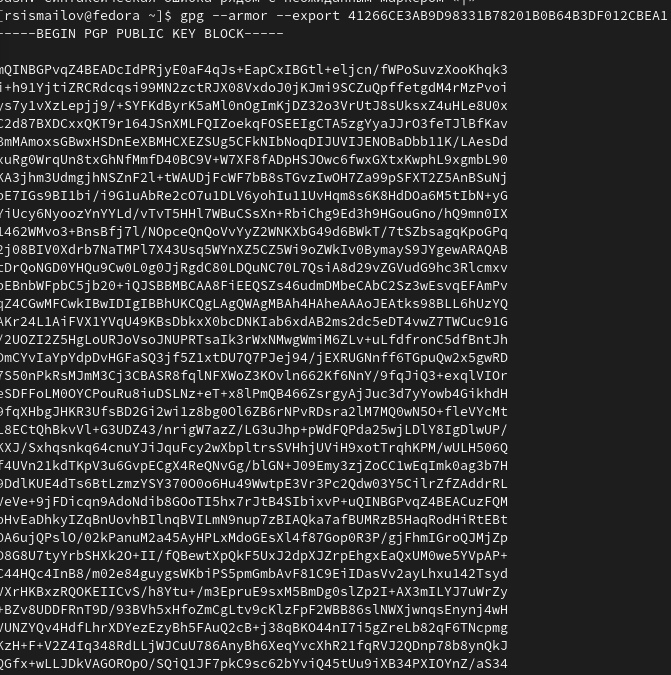
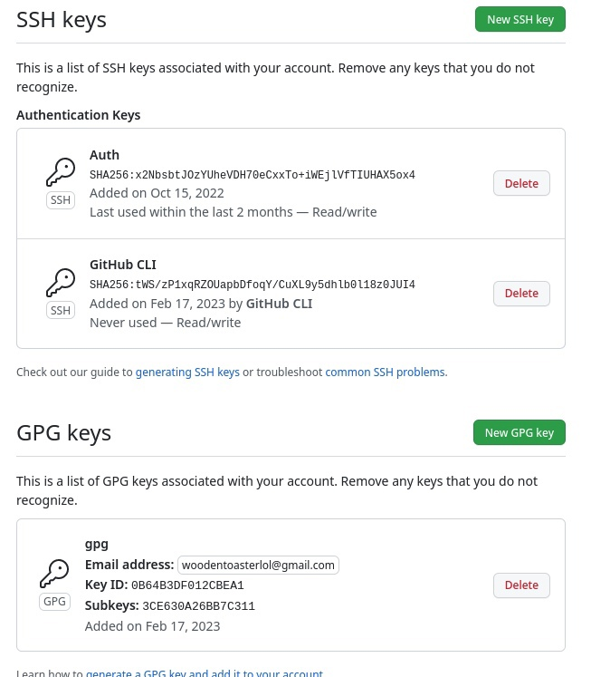
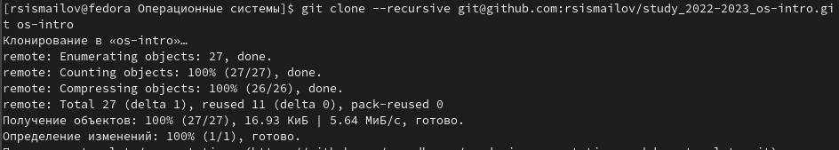
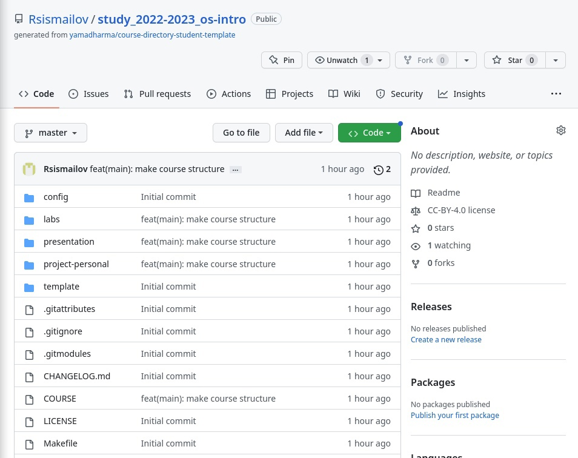

---
## Front matter
lang: ru-RU
title: Структура научной презентации
subtitle: Простейший шаблон
author:
  - Руслан Исмаилов Шухратович
institute:
  - Российский университет дружбы народов, Москва, Россия
date: 18 Февраля 2023

## i18n babel
babel-lang: russian
babel-otherlangs: english

## Formatting pdf
toc: false
toc-title: Содержание
slide_level: 2
aspectratio: 169
section-titles: true
theme: metropolis
header-includes:
 - \metroset{progressbar=frametitle,sectionpage=progressbar,numbering=fraction}
 - '\makeatletter'
 - '\beamer@ignorenonframefalse'
 - '\makeatother'
---

# Вводная часть

## Цель работы

- Важно донести результаты своих исследований до окружающих
- Научная презентация --- рабочий инструмент исследователя
- Необходимо создавать презентацию быстро
- Желательна минимизация усилий для создания презентации

## Задачи

- Презентация как текст
- Программное обеспечение для создания презентаций
- Входные и выходные форматы презентаций

# Выполнение работы

## Шаг 1 

Начнем с установки git и gh, требуемых для выполнения последующей работы. Это можно сделать при помощи команды sudo dnf install

{#fig:001 width=70%}

## Шаг 2 

::: incremental

- Далее требуется провести базовую настройку, а именно:

- установить имя и почту пользователя

- Настроика utf-8 в выводе сообщений git

- Зададим имя начальной ветки 

- и прочее.

:::

## Шаг 2 

{#fig:002 width=70%}

## Шаг 3 

Нам требуется сгенирировать ключи для использования github: 

Ssh

{#fig:003 width=70%}

## Шаг 3

Pgp

{#fig:004 width=70%}

## Шаг 4 

Привязываем их к аккаунту на github.com, после авторизации (можно выполнить через консоль)

{#fig:005 width=70%}

## Шаг 5

Создадим репозиторий курса на основе шаблона:

{#fig:006 width=70%}

## Шаг 6

Отправим все файлы нового локального каталога курса на github:

{#fig:007 width=70%}

## Конец

Спасибо за внимание!
