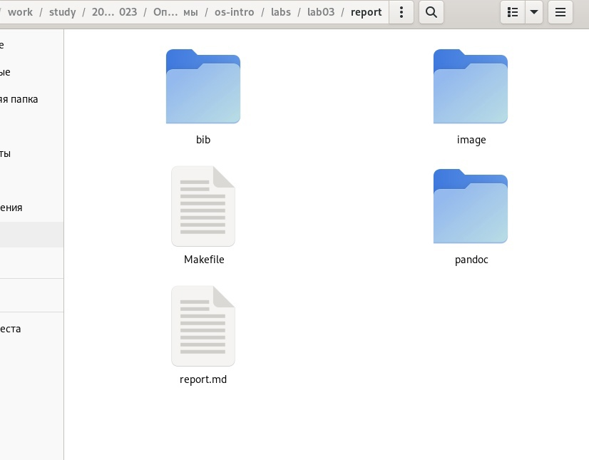
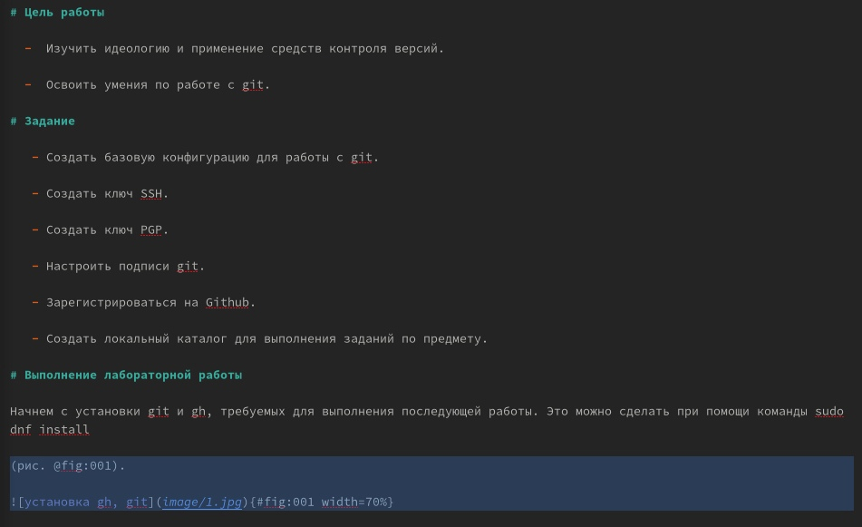
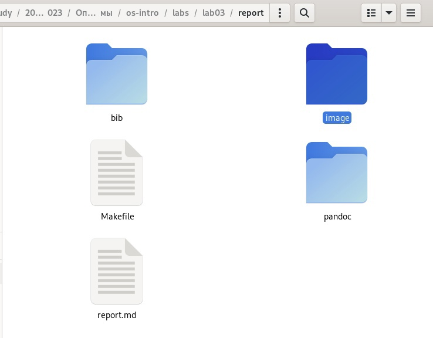
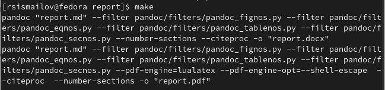
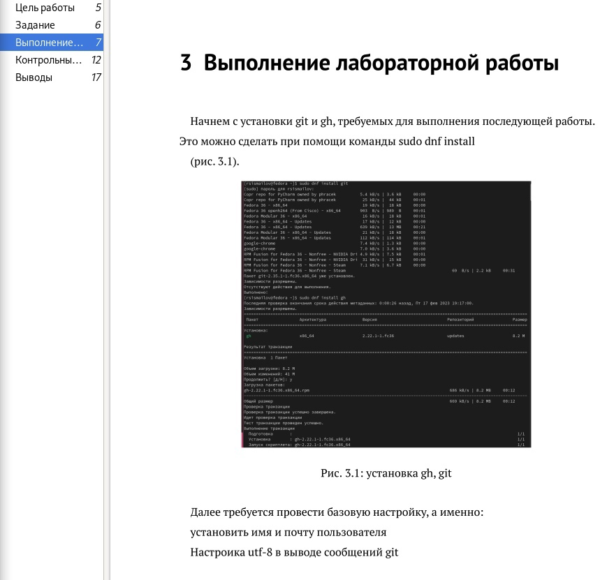

---
## Front matter
lang: ru-RU
title: Структура научной презентации
subtitle: Простейший шаблон
author:
  - Руслан Исмаилов Шухратович
institute:
  - Российский университет дружбы народов, Москва, Россия
date: 25 Февраля 2023

## i18n babel
babel-lang: russian
babel-otherlangs: english

## Formatting pdf
toc: false
toc-title: Содержание
slide_level: 2
aspectratio: 169
section-titles: true
theme: metropolis
header-includes:
 - \metroset{progressbar=frametitle,sectionpage=progressbar,numbering=fraction}
 - '\makeatletter'
 - '\beamer@ignorenonframefalse'
 - '\makeatother'
---

# Вводная часть

## Цель работы

-   Научиться оформлять отчёты с помощью легковесного языка разметки Markdown.

## Задачи

-   Выполнить отчёт 3 и 2 лабораторной работы в Markdown

# Выполнение работы

## Шаг 1 

Редактируем предоставленный шаблон из папки локального репозитория /home/rsismailov/work/study/2022-2023/Операционные системы/os-intro/labs/lab03

{#fig:001 width=70%}

## Шаг 2 

::: incremental

- Для создания полного отчёта требуется выделить цель работы, 

- задание, 

- выводы 

- и вставить картинки с выполнением работы.

{#fig:002 width=70%}

:::

## Шаг 3 

Для того, чтобы добавить картинки в отчёт, нужно поместить их в папку image. 

{#fig:003 width=70%}

## Шаг 4 

Выполненный отчёт нужно скомпилировать с помощью терминала

{#fig:004 width=70%}

## Шаг 5

Далее стоит проверить отчёт на наличие ошибок во время компиляции. Как мы видим, все на своих местах и отчет выглядит, как и должен выглядеть

{#fig:005 width=70%}

## Конец

Спасибо за внимание!

