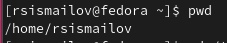
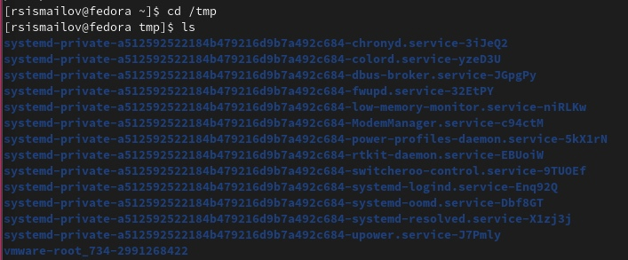
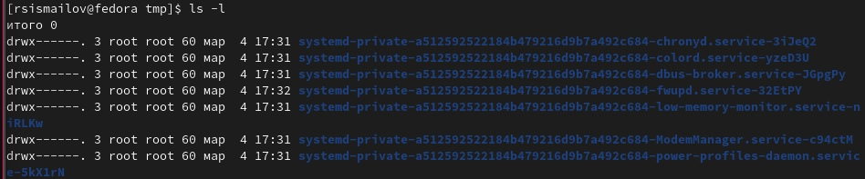
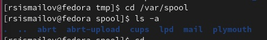
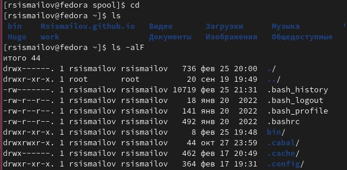
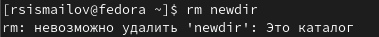
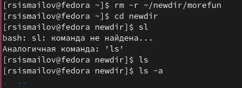
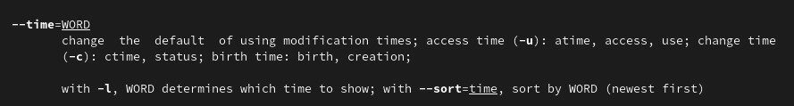
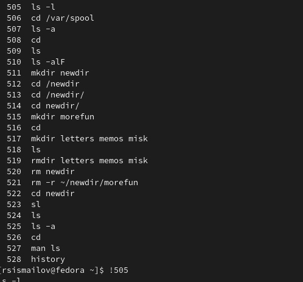

---
## Front matter
lang: ru-RU
title: Лабораторная работа 4 
author:
  - Руслан Исмаилов Шухратович
institute:
  - Российский университет дружбы народов, Москва, Россия
date: 25 Февраля 2023

## i18n babel
babel-lang: russian
babel-otherlangs: english

## Formatting pdf
toc: false
toc-title: Содержание
slide_level: 2
aspectratio: 169
section-titles: true
theme: metropolis
header-includes:
 - \metroset{progressbar=frametitle,sectionpage=progressbar,numbering=fraction}
 - '\makeatletter'
 - '\beamer@ignorenonframefalse'
 - '\makeatother'
---

# Вводная часть

## Цель работы

-  Приобретение практических навыков взаимодействия пользователя с системой по-
средством командной строки.

## Задачи

-   Использовать множество разных команд для того, чтобы изменить каталоги 

# Выполнение работы

## Шаг 1 

Определяем полное имя нашего домашнего каталога с помощью команды pwd 

{#fig:001 width=70%}

## Шаг 2 

Далее, переходим  в каталог /tmp, Выводим на экран содержимое каталога /tmp, для этого используем ls и ls -l, последнее выводит права доступа и дату создания файла 

{#fig:002 width=70%}

## Шаг 2 

{#fig:003 width=70%}

## Шаг 3 

С помощь cd и ls переходим в нужный каталог и проверяем его содержимое. Его нет

{#fig:004 width=70%}

## Шаг 4 

В домашнем каталоге убедимся, что я являюсь владельцем файлов

{#fig:005 width=70%}

## Шаг 5

пытаемся удалить каталог с помощью rm, это не работает.

{#fig:007 width=70%}

## Шаг 6
удаляем каталог morefun, проверяем.

{#fig:008 width=70%}

## Шаг 7

с помощью команды man определим какие опции имеет команды ls, cd, pwd, mkdir, rmdir, rm

например, опции команды cd: 
−L , переходить по символическим ссылкам . По умолчанию cd ведет себя так, как если бы указана опция -L .

−P , не переходите по символическим ссылкам. Другими словами, когда эта опция указана, и вы пытаетесь перейти к символической ссылке, которая указывает на каталог, cd перейдет в каталог.

{#fig:009 width=70%}

## Шаг 8

С помощью команды смотрим команды из буфера команд и исполним одну. 

{#fig:010 width=70%}

## Конец

Спасибо за внимание!

