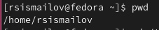
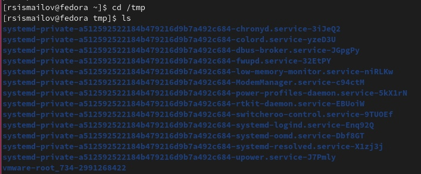
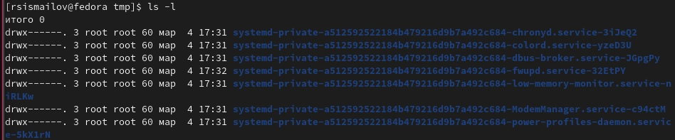
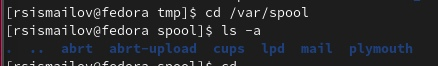
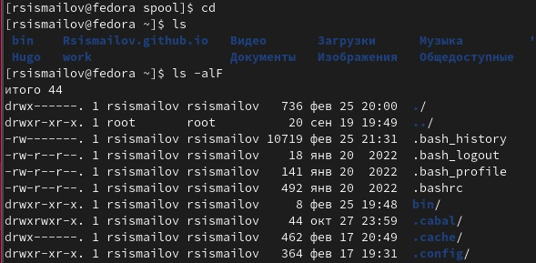
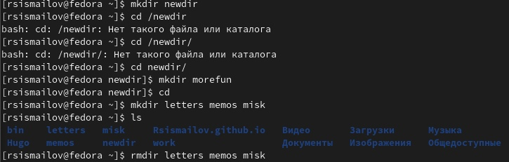
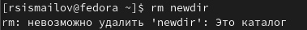
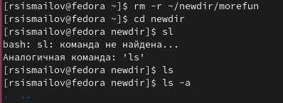
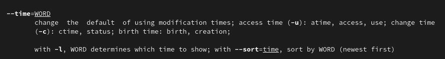
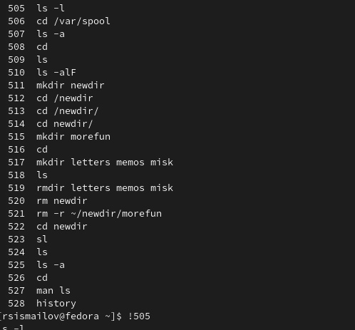

---
## Front matter
title: "Лабораторная работа 4"
author: "Руслан Исмаилов Шухратович"

## Generic otions
lang: ru-RU
toc-title: "Содержание"

## Bibliography
bibliography: bib/cite.bib
csl: pandoc/csl/gost-r-7-0-5-2008-numeric.csl

## Pdf output format
toc: true # Table of contents
toc-depth: 2
lof: true # List of figures
lot: true # List of tables
fontsize: 12pt
linestretch: 1.5
papersize: a4
documentclass: scrreprt
## I18n polyglossia
polyglossia-lang:
  name: russian
  options:
	- spelling=modern
	- babelshorthands=true
polyglossia-otherlangs:
  name: english
## I18n babel
babel-lang: russian
babel-otherlangs: english
## Fonts
mainfont: PT Serif
romanfont: PT Serif
sansfont: PT Sans
monofont: PT Mono
mainfontoptions: Ligatures=TeX
romanfontoptions: Ligatures=TeX
sansfontoptions: Ligatures=TeX,Scale=MatchLowercase
monofontoptions: Scale=MatchLowercase,Scale=0.9
## Biblatex
biblatex: true
biblio-style: "gost-numeric"
biblatexoptions:
  - parentracker=true
  - backend=biber
  - hyperref=auto
  - language=auto
  - autolang=other*
  - citestyle=gost-numeric
## Pandoc-crossref LaTeX customization
figureTitle: "Рис."
tableTitle: "Таблица"
listingTitle: "Листинг"
lofTitle: "Список иллюстраций"
lotTitle: "Список таблиц"
lolTitle: "Листинги"
## Misc options
indent: true
header-includes:
  - \usepackage{indentfirst}
  - \usepackage{float} # keep figures where there are in the text
  - \floatplacement{figure}{H} # keep figures where there are in the text
---

# Цель работы

  -  Приобретение практических навыков взаимодействия пользователя с системой по-
средством командной строки.

# Задание

1. Определите полное имя вашего домашнего каталога. Далее относительно этого ката-
лога будут выполняться последующие упражнения.

2. Выполните следующие действия:
2.1. Перейдите в каталог /tmp.
2.2. Выведите на экран содержимое каталога /tmp. Для этого используйте команду ls
с различными опциями. Поясните разницу в выводимой на экран информации.
2.3. Определите, есть ли в каталоге /var/spool подкаталог с именем cron?
2.4. Перейдите в Ваш домашний каталог и выведите на экран его содержимое. Опре-
делите, кто является владельцем файлов и подкаталогов?

3. Выполните следующие действия:
3.1. В домашнем каталоге создайте новый каталог с именем newdir.
3.2. В каталоге ~/newdir создайте новый каталог с именем morefun.
3.3. В домашнем каталоге создайте одной командой три новых каталога с именами
letters, memos, misk. Затем удалите эти каталоги одной командой.
3.4. Попробуйте удалить ранее созданный каталог ~/newdir командой rm. Проверьте,
был ли каталог удалён.
3.5. Удалите каталог ~/newdir/morefun из домашнего каталога. Проверьте, был ли
каталог удалён.

4. С помощью команды man определите, какую опцию команды ls нужно использо-
вать для просмотра содержимое не только указанного каталога, но и подкаталогов,
входящих в него.

5. С помощью команды man определите набор опций команды ls, позволяющий отсорти-
ровать по времени последнего изменения выводимый список содержимого каталога
с развёрнутым описанием файлов.

6. Используйте команду man для просмотра описания следующих команд: cd, pwd, mkdir,
rmdir, rm. Поясните основные опции этих команд.

7. Используя информацию, полученную при помощи команды history, выполните мо-
дификацию и исполнение нескольких команд из буфера команд.

# Выполнение лабораторной работы

Определяем полное имя нашего домашнего каталога с помощью команды pwd 

(рис. @fig:001).

{#fig:001 width=70%}

Далее, переходим  в каталог /tmp, Выводим на экран содержимое каталога /tmp, для этого используем ls и ls -l, последнее выводит права доступа и дату создания файла 

(рис. @fig:002).

{#fig:002 width=70%}

(рис. @fig:003).

{#fig:003 width=70%}

С помощь cd и ls переходим в нужный каталог и проверяем его содержимое. Его нет

(рис. @fig:004).

{#fig:004 width=70%}

В домашнем каталоге убедимся, что я являюсь владельцем файлов

(рис. @fig:005).

{#fig:005 width=70%}

Создаем каталоги и удаляем их 

(рис. @fig:006).

{#fig:005 width=70%}

пытаемся удалить каталог с помощью rm, это не работает.

(рис. @fig:007).

{#fig:005 width=70%}

удаляем каталог morefun, проверяем.

(рис. @fig:008).

{#fig:005 width=70%}

с помощью команды man определим какие опции имеет команды ls, cd, pwd, mkdir, rmdir, rm

например, опции команды cd: 
−L , переходить по символическим ссылкам . По умолчанию cd ведет себя так, как если бы указана опция -L .

−P , не переходите по символическим ссылкам. Другими словами, когда эта опция указана, и вы пытаетесь перейти к символической ссылке, которая указывает на каталог, cd перейдет в каталог.

(рис. @fig:009).

{#fig:005 width=70%}

С помощью команды смотрим команды из буфера команд и исполним одну. 

(рис. @fig:010).

{#fig:005 width=70%}

# Контрольные вопросы 

    Что такое командная строка? Командная строка (консоль или Терминал) – это специальная программа, которая позволяет управлять компьютером путем ввода текстовых команд с клавиатуры.
    При помощи какой команды можно определить абсолютный путь текущего каталога? Приведите пример. Команда pwd. Для определения абсолютного пути к текущему каталогу используется команда pwd (print working directory). Пример (абсолютное имя текущего каталога пользователя dharma): 1 pwd результат: 1 /afs/dk.sci.pfu.edu.ru/home/d/h/dharma
    При помощи какой команды и каких опций можно определить только тип файлов и их имена в текущем каталоге? Приведите примеры. Команда ls сначала выводит список всех файлов (не каталогов), перечисленных в командной строке, а затем выводит список всех файлов, находящихся в каталогах, перечисленных в командной строке. Если не указано ни одного файла, то по умолчанию аргументом назначается . (текущий каталог). Опция -d заставляет ls не считать аргументы-каталоги каталогами. Будут отображаться только файлы, которые не начинаются с . или все файлы, если задана опция -a.
    Каким образом отобразить информацию о скрытых файлах? Приведите примеры. С помощью команды ls -a
    При помощи каких команд можно удалить файл и каталог? Можно ли это сделать одной и той же командой? Приведите примеры. Команда rm. Команда rm используется для удаления файлов и/или каталогов. Формат команды: rm [-опции] [файл] Если требуется, чтобы выдавался запрос подтверждения на удаление файла, то необхо- димо использовать опцию i. Чтобы удалить каталог, содержащий файлы, нужно использовать опцию r. Без указания этой опции команда не будет выполняться. Пример: mkdir abs rm abc rm -r abc
    Каким образом можно вывести информацию о последних выполненных пользовате- лем командах? работы? ls -t
    Как воспользоваться историей команд для их модифицированного выполнения? При- ведите примеры. history !1
    Приведите примеры запуска нескольких команд в одной строке. Например, мы хотим выполнить сначала одну команду. Затем, когда она отработает (вернет управление в командную строку), нам нужно запустить вторую команду. Для этого служит символ точка с запятой ;. Таким образом, если вы выполните в терминале: mycommand1; mycommand2; mycommand3 то сначала запустится первая команда mycommand1, а когда управление вернется в терминал, то запустится вторая и так далее.
    Дайте определение и приведите примера символов экранирования. Экранирование символов — замена в тексте управляющих символов на соответствующие текстовые подстановки. Один из видов управляющих последовательностей. Экранирование группы символов В языке программирования python экранирование группы символов в строке осуществляется указанием буквы r (от англ. raw — необработанный) перед строкой, т. е. символы экранируются последовательностями r"экранируемый текст" В вики-разметке экранирование текста осуществляется с помощью псевдотегов и . Если нужно записать сам псевдотег , это делается символами подстановки (<nowiki>).
    Охарактеризуйте вывод информации на экран после выполнения команды ls с опцией l. -l - выводить подробный список, в котором будет отображаться владелец, группа, дата создания, размер и другие параметры;
    Что такое относительный путь к файлу? Приведите примеры использования относи- тельного и абсолютного пути при выполнении какой-либо команды. В случае абсолютной адресации путь к каталогу указывается, начиная с корневого каталога, и далее вниз по дереву папок до требуемого. Так все следующие записи являются абсолютными адресами: /home/pl/Desktop, /boot, /etc/vim. Первый знак слэша (/) обозначает корневой каталог.
    Как получить информацию об интересующей вас команде? При относительной адресации путь к каталогу указывается, начиная с текущего каталога (другими словами, относительно текущего каталога). Когда используется относительная адресация, слэш никогда не бывает первым знаком
    Какая клавиша или комбинация клавиш служит для автоматического дополнения вводимых команд? Tab — автоматическое завершение набора имени файла, директории или команды.

# Выводы

Я успешно ознакомился с работой терминала 

