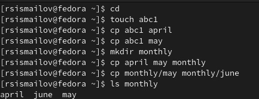
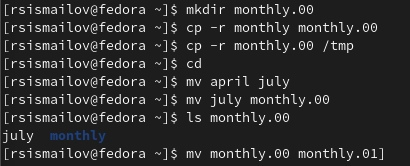
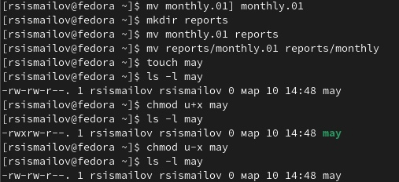
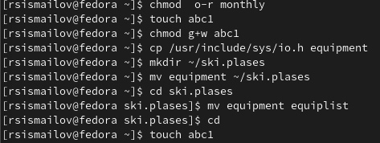
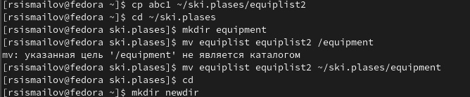
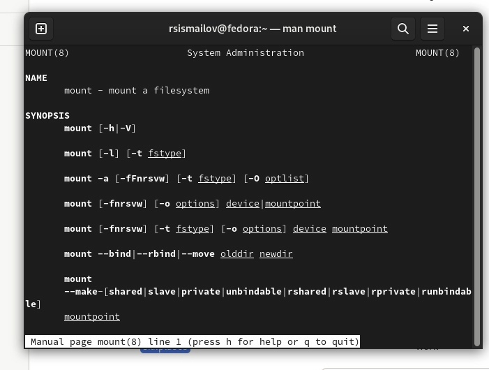
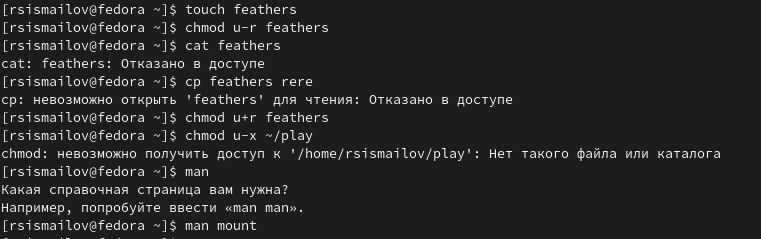

---
## Front matter
lang: ru-RU
title: Лабораторная работа 4 
author:
  - Руслан Исмаилов Шухратович
institute:
  - Российский университет дружбы народов, Москва, Россия
date: 25 Февраля 2023

## i18n babel
babel-lang: russian
babel-otherlangs: english

## Formatting pdf
toc: false
toc-title: Содержание
slide_level: 2
aspectratio: 169
section-titles: true
theme: metropolis
header-includes:
 - \metroset{progressbar=frametitle,sectionpage=progressbar,numbering=fraction}
 - '\makeatletter'
 - '\beamer@ignorenonframefalse'
 - '\makeatother'
---

# Вводная часть

## Цель работы

 Ознакомление с файловой системой Linux, её структурой, именами и содержанием
каталогов. Приобретение практических навыков по применению команд для работы
с файлами и каталогами, по управлению процессами (и работами), по проверке использования диска и обслуживанию файловой системы.

## Задачи

С помощью терминала научится переименовывать и копировать файлы и дериктории

# Выполнение работы

## Шаг 1 

Начнем с выполнения всех примеров

Для начала нужно скопировать файлы в каталог, переименовать их. Скопировав файлы, проверяем правильность выполнения задания командой ls

{#fig:001 width=70%}

## Шаг 2 

Продолжим копировать и переименовывать файлы и директории 

{#fig:002 width=70%}

## Шаг 3 

Теперь требуется поменять права на выполнения файла с помощью команды chmod

{#fig:003 width=70%}

## Шаг 4 

Меняем права на выполнение каталога monthly, файла abc1

{#fig:004 width=70%}

## Шаг 5

Создадим каталог с именем equipment в каталоге ~/ski.plases и переместим файлы ~/ski.plases/equiplist и equiplist2 в каталог ~/ski.plases/equipment. Затем создадим и переместим каталог ~/newdir в каталог ~/ski.plases и назовем его plans

{#fig:005 width=70%}

## Шаг 6
Прочитаем, что делают команды mount, kill с помощью команды man

{#fig:005 width=70%}

## Шаг 7

По заданию необходимо просмотреть содержимое файла /etc/password. Но при попытке сделать это, обнаруживаем, что такого файла у нас нет

Лишим владельца файла ~/feathers права на чтение. Проверим, что при попытке просмотреть файл ~/feathers командой cat нам отказано в доступе, также убедимся, что при попытке скопировать файл ~/feathers нам тоже отказано в доступе. Вернём обратно владельцу файла ~/feathers право на чтение

{#fig:005 width=70%}

## Конец

Спасибо за внимание!

