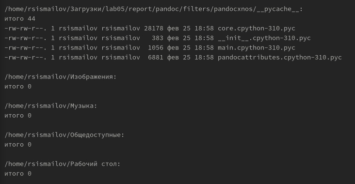
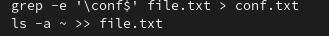
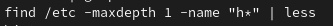
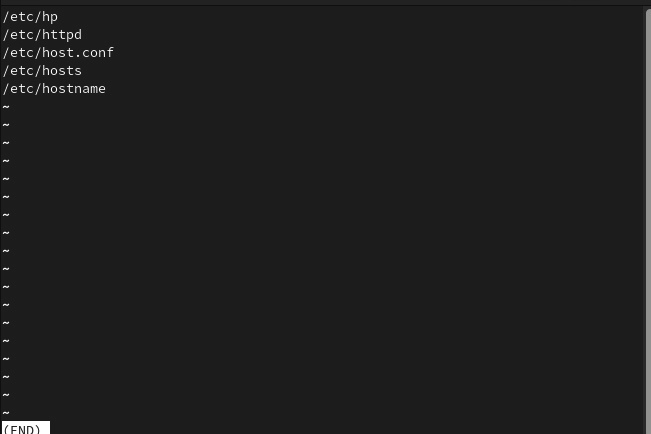
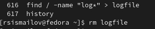
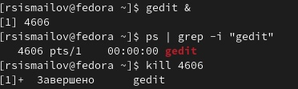
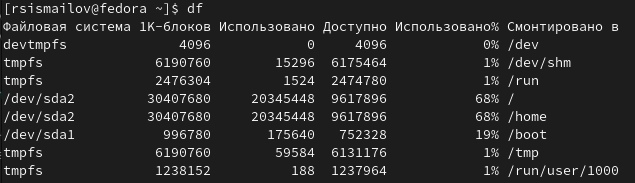

---
## Front matter
lang: ru-RU
title: Лабораторная работа 6с 
author:
  - Руслан Исмаилов Шухратович
institute:
  - Российский университет дружбы народов, Москва, Россия
date: 25 Февраля 2023

## i18n babel
babel-lang: russian
babel-otherlangs: english

## Formatting pdf
toc: false
toc-title: Содержание
slide_level: 2
aspectratio: 169
section-titles: true
theme: metropolis
header-includes:
 - \metroset{progressbar=frametitle,sectionpage=progressbar,numbering=fraction}
 - '\makeatletter'
 - '\beamer@ignorenonframefalse'
 - '\makeatother'
---

# Вводная часть

## Цель работы

ознакомление с инструментами поиска файлов и фильтрации текстовых данных. Приобретение практических навыков: по управлению процессами (и заданиями), по проверке использования диска и обслуживанию файловых систем.

## Задачи

Ознакомиться с инструментами поиска файлов и фильтрации текстовых данных. Приобрести практические навыки: по управлению процессами (и заданиями), по проверке использования диска и обслуживанию файловых систем.

# Выполнение работы

## Шаг 1 

Осуществляем вход в систему, записываем в файл file.txt названия файлов, содержащихся в каталоге /etc.

{#fig:001 width=70%}

## Шаг 2 

Выводим имена всех файлов из file.txt, имеющих расширение .conf, после чего записала их в новый текстовой файл сonf.txt

{#fig:002 width=70%}

## Шаг 3 

Определяем, какие файлы в домашнем каталоге имеют имена, начинающиеся с символа с

{#fig:003 width=70%}

## Шаг 4 

Выводим на экран имена файлов из каталога /etc, начинающиеся с символа h

{#fig:004 width=70%}

## Шаг 5

Запустим в фоновом режиме процесс, который будет записывать в файл ~/logfile файлы, имена которых начинаются с log. Затем удалим файл ~/logfile
(рис. @fig:005).

{#fig:005 width=70%}

## Шаг 6
Запустим из консоли в фоновом режиме редактор gedit. Также используя команду ps, конвейер и фильтр grep определим идентификатор процесса

После прочтения man kill используем эту команду и идентификатор процесса gedit для завершения процесса gedit

{#fig:005 width=70%}

## Шаг 7

выпонляем df и du

{#fig:005 width=70%}

## Шаг 7

{#fig:005 width=70%}

## Конец

Спасибо за внимание!

