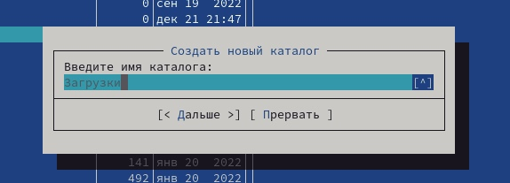

---
## Front matter
lang: ru-RU
title: Лабораторная работа 7
author:
  - Руслан Исмаилов Шухратович
institute:
  - Российский университет дружбы народов, Москва, Россия
date: 25 Февраля 2023

## i18n babel
babel-lang: russian
babel-otherlangs: english

## Formatting pdf
toc: false
toc-title: Содержание
slide_level: 2
aspectratio: 169
section-titles: true
theme: metropolis
header-includes:
 - \metroset{progressbar=frametitle,sectionpage=progressbar,numbering=fraction}
 - '\makeatletter'
 - '\beamer@ignorenonframefalse'
 - '\makeatother'
---

# Вводная часть

## Цель работы

Освоение основных возможностей командной оболочки Midnight Commander. Приоб-
ретение навыков практической работы по просмотру каталогов и файлов; манипуляций
с ними.

# Выполнение работы

## Шаг 1 

Внимательно изучаем мануал по команде mc.

{#fig:001 width=70%}

## Шаг 2 

выполняем мс 

Выполняем основные операции в оболочке (копирование файлов и каталогов и переименование файлов):

{#fig:002 width=70%}

## Шаг 3 

Копируем файл

{#fig:003 width=70%}

## Шаг 4 

Создаем новый каталог 

{#fig:004 width=70%}

## Шаг 5

Просмотрим содержимое текстового файла:

{#fig:005 width=70%}

## Шаг 6
Редактируем содержимое текстового файла:

{#fig:006 width=70%}

## Шаг 7

При помощи меню Команда  ищем  файлы 

{#fig:007 width=70%}

## Шаг 8

Проанализируем файлы меню и расширений:

{#fig:008 width=70%}

## 9

Освоим основные операции меню Настройки:

{#fig:009 width=70%}

## 10

Создадим файл 

{#fig:010 width=70%}

## 11

Отредактируем его 

{#fig:011 width=70%}

## 12

используя горячие клавиши, проведем с текстом манипуляции

{#fig:012 width=70%}

## Конец

Спасибо за внимание!

