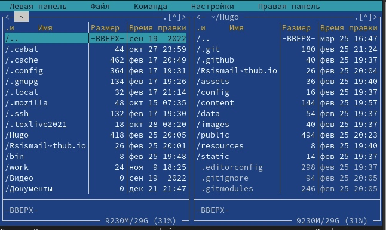
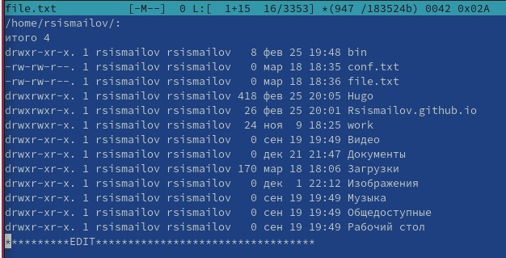
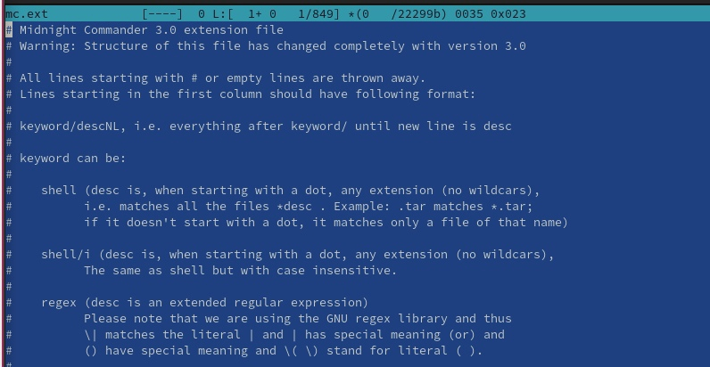
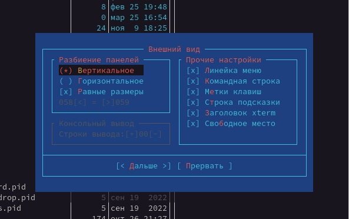
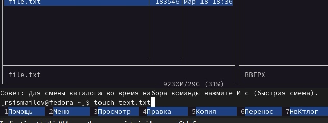

---
## Front matter
title: "Лабораторная работа 7"
author: "Руслан Исмаилов Шухратович"

## Generic otions
lang: ru-RU
toc-title: "Содержание"

## Bibliography
bibliography: bib/cite.bib
csl: pandoc/csl/gost-r-7-0-5-2008-numeric.csl

## Pdf output format
toc: true # Table of contents
toc-depth: 2
lof: true # List of figures
lot: true # List of tables
fontsize: 12pt
linestretch: 1.5
papersize: a4
documentclass: scrreprt
## I18n polyglossia
polyglossia-lang:
  name: russian
  options:
	- spelling=modern
	- babelshorthands=true
polyglossia-otherlangs:
  name: english
## I18n babel
babel-lang: russian
babel-otherlangs: english
## Fonts
mainfont: PT Serif
romanfont: PT Serif
sansfont: PT Sans
monofont: PT Mono
mainfontoptions: Ligatures=TeX
romanfontoptions: Ligatures=TeX
sansfontoptions: Ligatures=TeX,Scale=MatchLowercase
monofontoptions: Scale=MatchLowercase,Scale=0.9
## Biblatex
biblatex: true
biblio-style: "gost-numeric"
biblatexoptions:
  - parentracker=true
  - backend=biber
  - hyperref=auto
  - language=auto
  - autolang=other*
  - citestyle=gost-numeric
## Pandoc-crossref LaTeX customization
figureTitle: "Рис."
tableTitle: "Таблица"
listingTitle: "Листинг"
lofTitle: "Список иллюстраций"
lotTitle: "Список таблиц"
lolTitle: "Листинги"
## Misc options
indent: true
header-includes:
  - \usepackage{indentfirst}
  - \usepackage{float} # keep figures where there are in the text
  - \floatplacement{figure}{H} # keep figures where there are in the text
---

# Цель работы

  Освоение основных возможностей командной оболочки Midnight Commander. Приоб-
ретение навыков практической работы по просмотру каталогов и файлов; манипуляций
с ними.

# Выполнение лабораторной работы

Внимательно изучаем мануал по команде mc.

(рис. @fig:001).

{#fig:001 width=70%}

выполняем мс 

Выполняем основные операции в оболочке (копирование файлов и каталогов и переименование файлов):

(рис. @fig:002).

{#fig:002 width=70%}

Копируем файл

(рис. @fig:003).

{#fig:003 width=70%}

Создаем новый каталог 

(рис. @fig:004).

{#fig:004 width=70%}

Просмотрим содержимое текстового файла:

(рис. @fig:005).

{#fig:005 width=70%}

Редактируем содержимое текстового файла:

(рис. @fig:006).

{#fig:006 width=70%}

При помощи меню Команда  ищем  файлы 

(рис. @fig:007).

{#fig:007 width=70%}

Проанализируем файлы меню и расширений:

(рис. @fig:008).

{#fig:008 width=70%}

Освоим основные операции меню Настройки:

(рис. @fig:009).

{#fig:009 width=70%}

Создадим файл 

(рис. @fig:010).

{#fig:010 width=70%}

Отредактируем его 

(рис. @fig:010).

{#fig:011 width=70%}

используя горячие клавиши, проведем с текстом манипуляции

(рис. @fig:012).

{#fig:012 width=70%}

# Ответы на контрольные вопросы

    Панели могут дополнительно быть переведены в один из двух режимов: «Информация» или «Дерево». В режиме «Информация» на панель выводятся сведения о файле и текущей файловой системе, расположенных на активной панели. В режиме «Дерево» на одной из панелей выводится структура дерева каталогов.
    Как с помощью команд shell, так и с помощью меню (комбинаций клавиш) mc можно выполнить следующие операции с файлами:  копирование «F5» («cp имя_файла имя_каталога(в который копируем)») (Рисунок 14)  перемещение/переименование «F6» («mv имя_файла имя_каталога(в который перемещаем)») (Рисунок 15)  создание каталога «F7» («mkdir имя_каталога») (Рисунок 38)  удаление «F8» («rm имя_файла»)  изменение прав доступа «ctrl+x» («chmod u+x имя_файла»)
    Перейти в строку меню панелей mc можно с помощью функциональной клавиши «F9». В строке меню имеются пять меню: «Левая панель», «Файл», «Команда», «Настройки» и «Правая панель». Подпункт меню «Быстрый просмотр» позволяет выполнить быстрый просмотр содержимого панели. Подпункт меню «Информация» позволяет посмотреть информацию о файле или каталоге. В меню каждой (левой или правой) панели можно выбрать «Формат списка»:  стандартный − выводит список файлов и каталогов с указанием размера и времени правки;  ускоренный − позволяет задать число столбцов, на которые разбивается панель при выводе списка имён файлов или каталогов без дополнительной информации;  расширенный − помимо названия файла или каталога выводит сведения о правах доступа, владельце, группе, размере, времени правки;  определённый пользователем − позволяет вывести те сведения о файле или каталоге, которые задаст сам пользователь Подпункт меню «Порядок сортировки» позволяет задать критерии сортировки при выводе списка файлов и каталогов: без сортировки, по имени, расширенный, время правки, время доступа, время изменения атрибута, размер, узел.
    Команды меню «Файл»:  Просмотр («F3») − позволяет посмотреть содержимое текущего (или выделенного) файла без возможности редактирования.  Просмотр вывода команды («М» + «!») − функция запроса команды с параметрами (аргумент к текущему выбранному файлу).  Правка («F4») − открывает текущий (или выделенный) файл для его редактирования.  Копирование («F5») − осуществляет копирование одного или нескольких файлов или каталогов в указанное пользователем во всплывающем окне место.  Права доступа («Ctrl-x» «c») − позволяет указать (изменить) права доступа к одному или нескольким файлам или каталогам.  Жёсткая ссылка («Ctrl-x» «l») − позволяет создать жёсткую ссылку к текущему (или выделенному) файлу.  Символическая ссылка («Ctrl-x» «s») − позволяет создать символическую ссылку к текущему (или выделенному) файлу.  Владелец/группа («Ctrl-x» «o») − позволяет задать (изменить) владельца и имя группы для одного или нескольких файлов или каталогов.  Права (расширенные) − позволяет изменить права доступа и владения для одного или нескольких файлов или каталогов.  Переименование («F6») − позволяет переименовать (или переместить) один или несколько файлов или каталогов.  Создание каталога («F7») − позволяет создать каталог.  Удалить («F8») − позволяет удалить один или несколько файлов или каталогов.  Выход («F10») − завершает работу mc.
    Меню Команда В меню Команда содержатся более общие команды для работы с mc. Команды меню Команда:  Дерево каталогов − отображает структуру каталогов системы.  Поиск файла − выполняет поиск файлов по заданным параметрам.  Переставить панели − меняет местами левую и правую панели.  Сравнить каталоги («Ctrl-x» «d») − сравнивает содержимое двух каталогов.  Размеры каталогов − отображает размер и время изменения каталога (по умолчанию в mc размер каталога корректно не отображается).  История командной строки − выводит на экран список ранее выполненных в оболочке команд.  Каталоги быстрого доступа ( Ctrl-\») − при вызове выполняется быстрая смена текущего каталога на один из заданного списка.  Восстановление файлов − позволяет восстановить файлы на файловых системах ext2 и ext3.  Редактировать файл расширений − позволяет задать с помощью определённого синтаксиса действия при запуске файлов с определённым расширением (например, какое программного обеспечение запускать для открытия или редактирования файлов с расширением doc или docx).  Редактировать файл меню − позволяет отредактировать контекстное меню пользователя, вызываемое по клавише «F2».  Редактировать файл расцветки имён − позволяет подобрать оптимальную для пользователя расцветку имён файлов в зависимости от их типа.
    Меню Настройки содержит ряд дополнительных опций по внешнему виду и функциональности mc. Меню Настройки содержит:  Конфигурация − позволяет скорректировать настройки работы с панелями.  Внешний вид и Настройки панелей − определяет элементы (строка меню, командная строка, подсказки и прочее), отображаемые при вызове mc, а также геометрию расположения панелей и цветовыделение.  Биты символов − задаёт формат обработки информации локальным терминалом.  Подтверждение − позволяет установить или убрать вывод окна с запросом подтверждения действий при операциях удаления и перезаписи файлов, а также при выходе из программы.  Распознание клавиш − диалоговое окно используется для тестирования функциональных клавиш, клавиш управления курсором и прочее.  Виртуальные ФС − настройки виртуальной файловой системы: тайм-аут, пароль и прочее.
    Функциональные клавиши mc:  F1 – вызов контекстно-зависимой подсказки  F2 – вызов пользовательского меню с возможностью создания и/или дополнения дополнительных функций  F3 – просмотр содержимого файла, на который указывает подсветка в активной панели (без возможности редактирования)  F4 – вызов встроенного в mc редактора для изменения содержания файла, на который указывает подсветка в активной панели  F5 – копирование одного или нескольких файлов, отмеченных в первой (активной) панели, в каталог, отображаемый на второй панели  F6 – перенос одного или нескольких файлов, отмеченных в первой (активной) панели, в каталог, отображаемый на второй панели  F7 – создание подкаталога в каталоге, отображаемом в активной панели  F8 – удаление одного или нескольких файлов (каталогов), отмеченных в первой (активной) панели файлов  F9 – вызов меню mc  F10 – выход из mc
    Встроенный в mc редактор вызывается с помощью функциональной клавиши «F4». В нём удобно использовать различные комбинации клавиш при редактировании содержимого (как правило текстового) файла. Клавиши для редактирования файла:  «Ctrl-y» − удалить строку  «Ctrl-u» − отмена последней операции  «ins» вставка/замена  «F7» − поиск (можно использовать регулярные выражения)  «↑-F7» − повтор последней операции поиска  «F4» − замена  «F3» − первое нажатие − начало выделения, второе − окончание выделения  «F5» − копировать выделенный фрагмент  «F6» − переместить выделенный фрагмент  «F8» − удалить выделенный фрагмент  «F2» − записать изменения в файл  «F10» − выйти из редактор
    Для редактирования меню пользователя, которое вызывается клавишей «F2», необходимо перейти в пункт «Редактировать файл меню» → «Команда» и изменить настройки файла.
    Часть команд «Меню пользователя», а также меню «Файл» позволяют выполнять действия, определяемые пользователем, над текущим файлом. Например, копирование каталога или файла, переименование, перемещение, архивирование.

# Выводы

Я освоил основных возможностей командной оболочки Midnight Commander.

