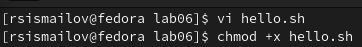
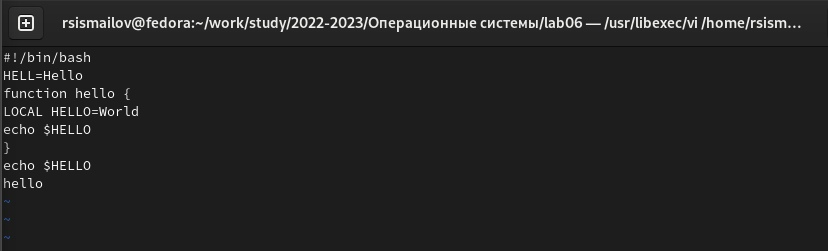
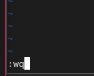
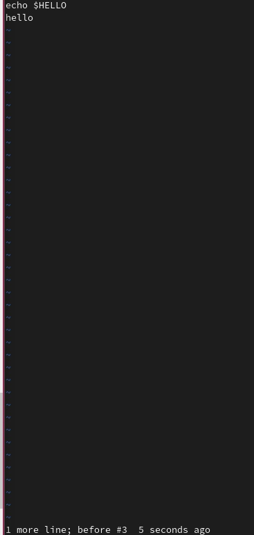

---
## Front matter
lang: ru-RU
title: Лабораторная работа 8
author:
  - Руслан Исмаилов Шухратович
institute:
  - Российский университет дружбы народов, Москва, Россия
date: 25 Февраля 2023

## i18n babel
babel-lang: russian
babel-otherlangs: english

## Formatting pdf
toc: false
toc-title: Содержание
slide_level: 2
aspectratio: 169
section-titles: true
theme: metropolis
header-includes:
 - \metroset{progressbar=frametitle,sectionpage=progressbar,numbering=fraction}
 - '\makeatletter'
 - '\beamer@ignorenonframefalse'
 - '\makeatother'
---

# Вводная часть

## Цель работы

Познакомиться с операционной системой Linux. Получить практические навыки работы с редактором vi, установленным по умолчанию практически во всех дистрибутивах.

# Выполнение работы

## Шаг 1 

Ознакомимся с теоретическим материалом, и с редактором vi.
Bыполнить упражнения, используя команды vi

Создадим каталог с именем ~/work/os/lab06., и файл hello.sh

{#fig:001 width=70%}

## Шаг 2 

Введем туда текст; используем комбинации клавиш, чтобы записать файл и выйти

{#fig:002 width=70%}

## Шаг 2

{#fig:003 width=70%}

## Шаг 3

Делаем файл исполняемым, снова редактируем его, в этот раз меняем текст и отменяем удаление последней строчки. снова сохраняем файл 

{#fig:004 width=70%}

## Конец

Спасибо за внимание!

