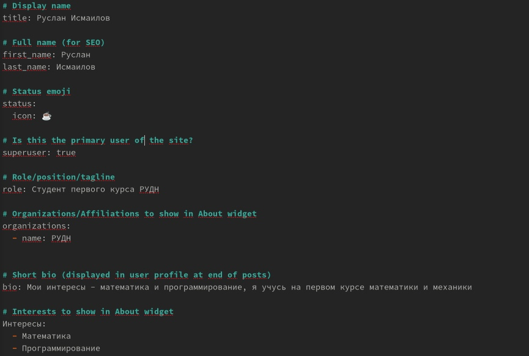
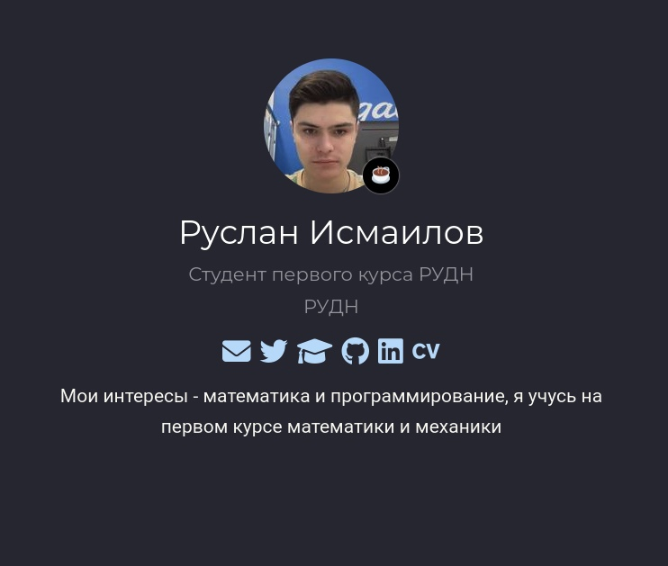
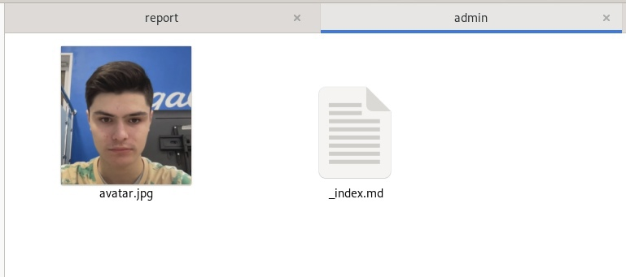
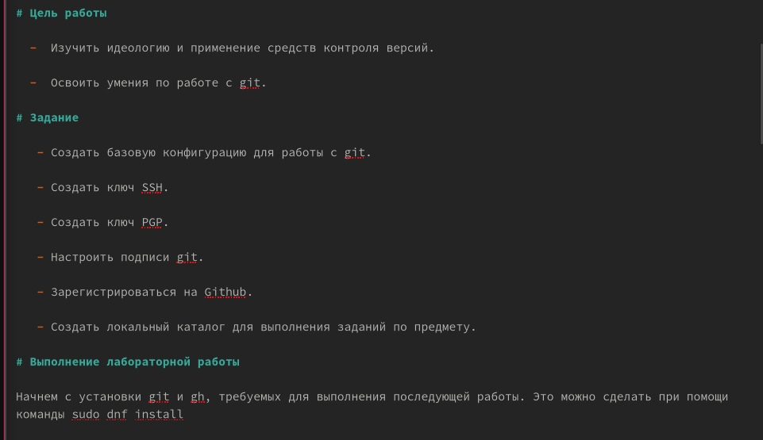
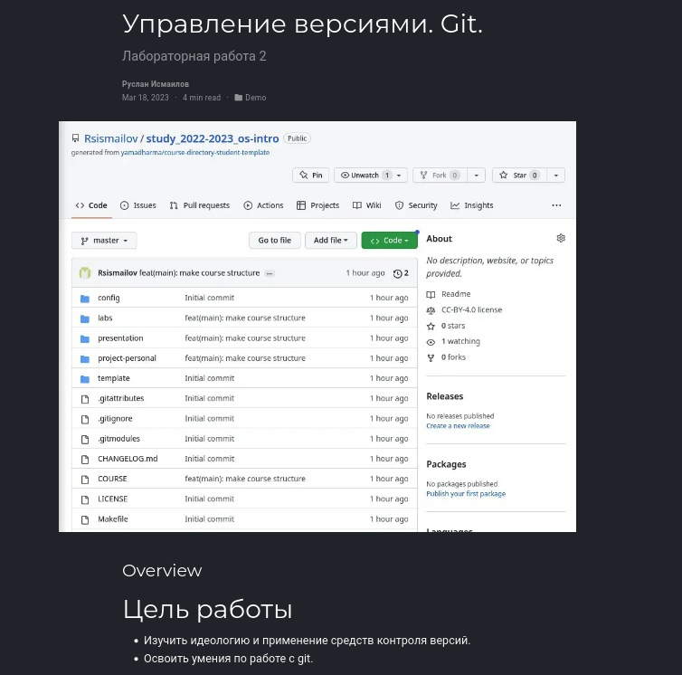

---
## Front matter
lang: ru-RU
title: "Отчёт о выполнении. Индивидуальный проект. Этап 2"
author: "Руслан Исмаилов Шухратович"

institute:
  - Российский университет дружбы народов, Москва, Россия
date: 25 Февраля 2023

## i18n babel
babel-lang: russian
babel-otherlangs: english

## Formatting pdf
toc: false
toc-title: Содержание
slide_level: 2
aspectratio: 169
section-titles: true
theme: metropolis
header-includes:
 - \metroset{progressbar=frametitle,sectionpage=progressbar,numbering=fraction}
 - '\makeatletter'
 - '\beamer@ignorenonframefalse'
 - '\makeatother'
---

# Вводная часть

## Цель работы

Целью данной работы является создание собственного сайта

## Задание

Доработать сайт и добавить пост

# Выполнение работы

## Шаг 1 

Редактируем /home/rsismailov/Hugo/content/authors/_index.md, для того, чтобы поменять на нашем сайте описание автора. 

{#fig:001 width=70%}

## Шаг 2 

Вот как будут выглядеть внесенные изменения на нашем сайте. 

{#fig:002 width=70%} 

## Шаг 3 

Добавим фотографию, заменив файл avatar.png

{#fig:003 width=70%}

## Шаг 4 

Добавим пост на тему управление версиями. Git.

для этого отредактируем один из существующих постов

{#fig:004 width=70%}

## Шаг 5

Вот как выглядят изменения 

{#fig:005 width=70%}

## Конец

Спасибо за внимание!

